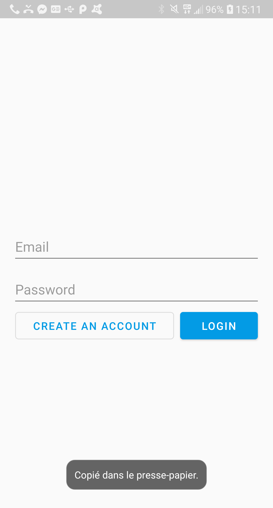
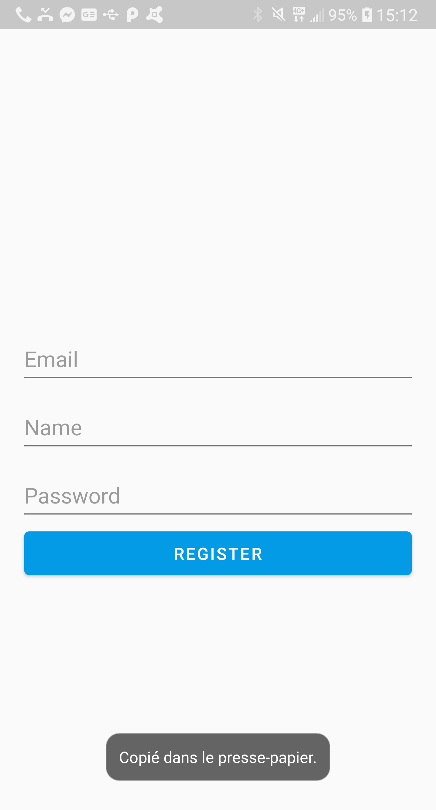

# Hollywood Messenger Android App
This is and Android application using Java.
This application access to the Hollywood Messenger Api, it allow to manage contacts list and send messages.
https://hollywood-messenger-mobile.glitch.me/

## Getting Started
Download the apk in the repository and install it on your android phone.

## Activities
### Login
A page where you can login: Email/password
Login button -> open Main Activity if correct login
Register button -> open Register Activity

### Register
A page where you can register.
Register Button -> close activity if the account is created

### Main
The main page which contains a bottom navigation with links to 3 Fragments.

#### Discussions
Show all recent discutions of the users.

#### Contacts
Show all contact of the users.

#### Settings
Allow to change Pseudo and logout.

### Messages
Show the messages between the user and another user or a group.
Send Button -> send a message

## Functionalities
* Gitflow
* MVC
* Recycler View And Fragments
* Cache of data
* Access to a REST API
* Shared Preferences for user login

## Built With
* [Hollywood-Messenger](https://hollywood-messenger-mobile.glitch.me/) - Hollywood Messenger
* [Retrofit](https://square.github.io/retrofit/) - To access to Rest API
* [ROOM](https://developer.android.com/training/data-storage/room/index.html) - To do caching

## Authors
* **Lucas Alias** - [Ekrynox](https://github.com/Ekrynox)
